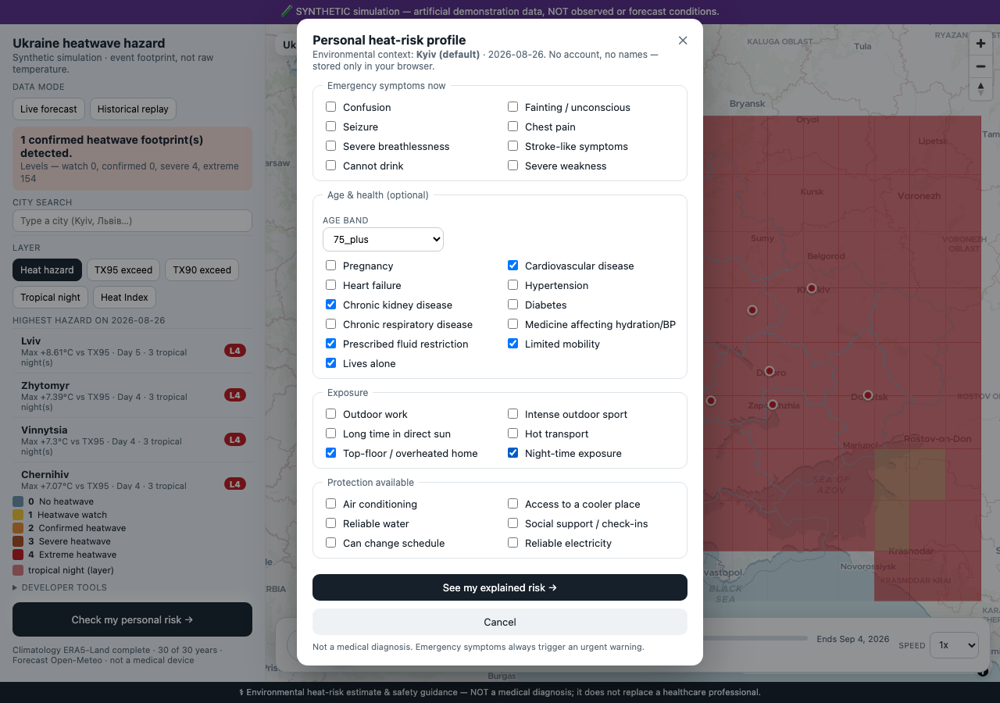
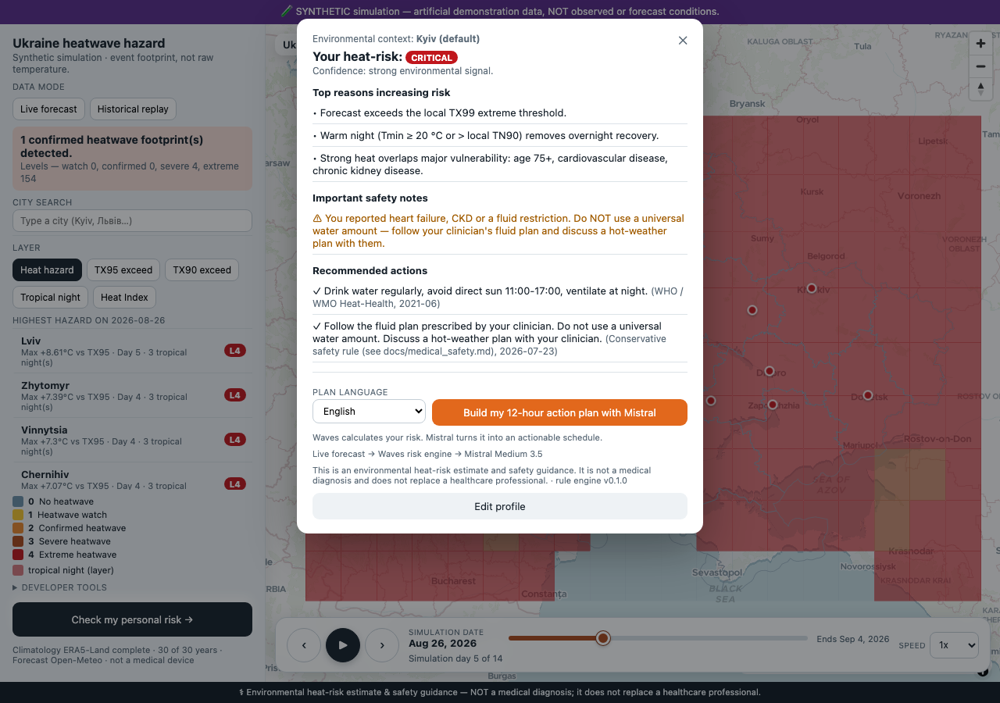
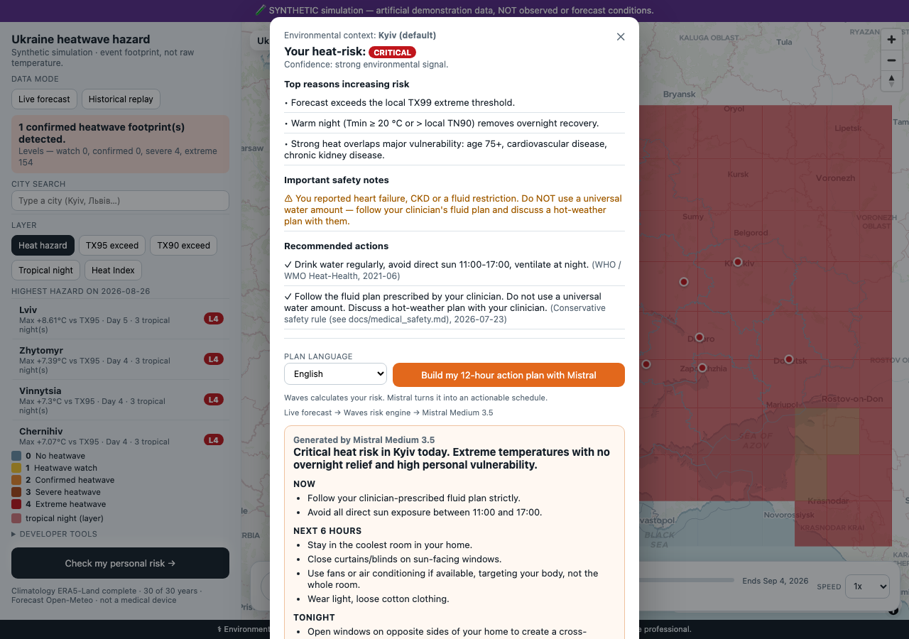
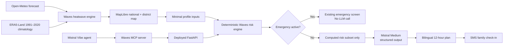

# Waves — heatwave hazard & personal risk for Ukraine

[**Open the live demo →**](https://waves-nine-gold.vercel.app)

Waves turns Ukraine-wide heatwave forecasts into an explainable, personal action flow: explore the national hazard map, drill into Kyiv districts, calculate a deterministic risk level for a fictional or real-world profile, and ask Mistral to organize the approved guidance into a practical bilingual 12-hour plan. It is designed for clarity under pressure while keeping medical safety rules—and the final risk category—under Waves' control.

> **Not a medical device.** Waves provides environmental heat-risk estimates and safety guidance; it does not diagnose or replace a healthcare professional.

## Built today at the Mistral Vibe Hackathon

- **Mistral Medium structured-output bilingual action plans:** `mistral-medium-latest` returns a validated English or Ukrainian schedule for now, the next six hours, tonight, what to avoid, and a check-in message.
- **Privacy guardrails:** only the computed risk subset is sent to Mistral, never names, symptoms, or the complete raw health profile. The deterministic Waves risk category is immutable, and the emergency path never calls the LLM.
- **SMS family check-in loop:** create a one-hour, in-memory check-in session, open a prefilled two-sentence SMS, and see the page update when the recipient replies “I'm OK” or “Need help.” No names or health data are stored in the session.
- **MCP server for Mistral Vibe agents:** a minimal stdio server exposes privacy-safe `get_heat_risk` and `get_action_plan` tools backed by the deployed Waves API—without duplicating the risk engine.
- **District-level drill-down:** click Kyiv to preserve the selected forecast date, color every district with the national level 0–4 choropleth, and rank districts from the loaded forecast cells.

> **Pre-existing base:** The climatology and national map engine predate the event; the Mistral planning, privacy boundary, SMS check-in, MCP integration, and repaired Kyiv district experience were built for the hackathon.

## Demo flow

### 1. Create a vulnerable fictional profile



### 2. Waves calculates an immutable deterministic risk



### 3. Mistral builds the 12-hour action plan



## Architecture



The deterministic engine owns the risk category and safety rules. Mistral can organize only the supplied reasons, recommendations, protective factors, and guardrails; its structured response cannot change the Waves risk level.

## Run locally

Requirements: Python 3.12+, Node.js, and a server-side Mistral API key.

```bash
git clone https://github.com/VolodymyrLinuxovich/mistral-waves.git
cd mistral-waves

python3 -m venv .venv
.venv/bin/python -m pip install -r backend/requirements-api.txt
npm install

cp .env.example .env
# Add MISTRAL_API_KEY to .env; never expose it in frontend code or commit it.

set -a
source .env
set +a
./scripts/run_local.sh
```

Open [http://127.0.0.1:8080/frontend/index.html](http://127.0.0.1:8080/frontend/index.html). The API docs are at [http://127.0.0.1:8010/docs](http://127.0.0.1:8010/docs).

### Run the tests

```bash
PYTHONPATH=backend .venv/bin/python -m unittest discover -s backend/tests -v
.venv/bin/python -m pip install -r mcp/requirements-dev.txt
.venv/bin/python -m pytest mcp/tests -q
npx playwright install chromium
npx playwright test
```

### Run the MCP server

```bash
.venv/bin/python -m pip install -r mcp/requirements.txt
.venv/bin/python mcp/waves_mcp.py
```

See [mcp/README.md](mcp/README.md) for the Mistral Vibe CLI `mcp_servers` configuration block.

## Tech stack

- **Backend:** Python, FastAPI, Pydantic, official Mistral Python SDK
- **Risk and climate:** deterministic rules, NumPy, ERA5-Land 1991–2020 climatology, Open-Meteo forecast adapter
- **Frontend:** dependency-light HTML/CSS/JavaScript SPA with MapLibre GL
- **AI:** Mistral Medium custom structured output in English and Ukrainian
- **Agent integration:** official Python MCP SDK over stdio, HTTPX transport to the production API
- **Testing:** `unittest`, pytest, HTTPX mocks, Playwright
- **Deployment:** Vercel-hosted static frontend and FastAPI functions

## Safety and methodology

Waves separates **hazard**, **exposure**, **vulnerability**, and **health outcome**. Missing data stays missing, uncertainty remains visible, and special guardrails prevent universal hydration advice when fluid restriction applies. See [methodology](docs/methodology.md), [medical safety](docs/medical_safety.md), [limitations](docs/limitations.md), and [data provenance](docs/data_provenance.md).
